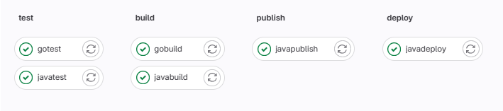
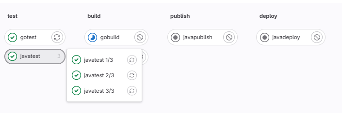
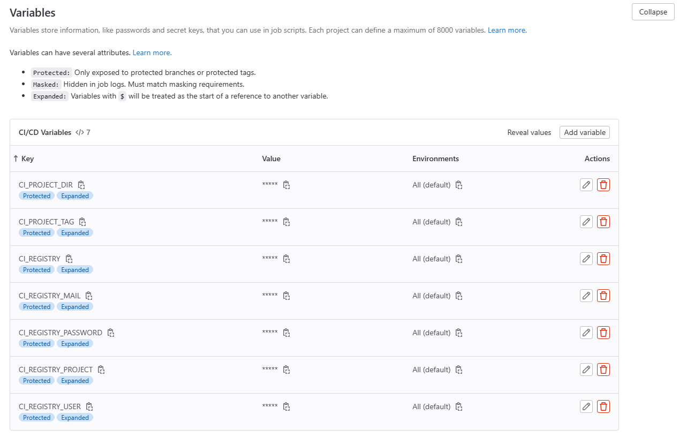

# GitLab CI/CD

CI/CD bir repo üzerinde herhangi bir event (push/commit vs.) gerçekleştiği zaman hangi işlemlerin yapılacağını gitlaba bildirmektir.

Bu işlemleri GitLab’a bildirmek yaml formatında yazacağımız ".gitlab-ci.yml" dosyasını kullanırız.

GitLab CI/CD, GitLab Runner üzerinden çalışır, GitLab runner gitlabdan tamamen bağımsız çalışabilir ve herhangi bir makineye kurulup o makine 
üzerinden de çalıştırılabilir.

GitLab Runner görevleri çalıştırırken kurulduğu makinenin komut satırını kullanabildiği gibi Docker desteği de sağlamaktadır.

## Stage

Stage'ler aşamaları temsil etmektedir. Bu aşamalar bizim belirlediğimiz bir sıra ile gerçekleşen işlemlerdir. Bir stage altında birden fazla job tanımlanabilir.

Genel olarak test, build, publish ya da deploy gibi kalıplaşmış stage isimlendirmeleri kullanabiliriz.

Stageler içinde birden fazla job tanımlaması yappabiliriz. Örneği test stage’i içerisinde, java testleri için ayrı bir task, go testleri için ayrı bir task yazabiliriz. Ya da build aşaması içerisinde farklı platformlar için ayrı ayrı görevler ile build işlemi gerçekleştirebiliriz.



## Job

Job'lar stageleer altında yer alırlar her bir job bir iş için tanımlanır.

Job tanımlamanın bir sınırı yoktur. Ancak Job'lar birbirlerinden bağımsız yapılandırılmaları gerekir.

- Pipeline'da çok fazla job tanımlandığı zaman bunları okumak zor hale gelir. Bu okumanın kolaylaşması için joblar gruplanabilmektedir.

```yml
javatest 1/3:
  stage: test
  script:
    - echo "javatest"

javatest 2/3:
  stage: test
  script:
    - echo "javatest"

javatest 3/3:
  stage: test
  script:
    - echo "javatest"
```



- Eğer GitLab Runner tarafından bir job'ın görmezden gelinmesini (işlenmemesi) istiyorsak bu jobın başına nokta koyulur.

```yml
.hidden-job:
  stage: hidden
  script: 
    - echo "hidden job script"
```

## Default

Tanımlanan bütün job'larda kullanılması gereken değişkenler var ise ve bu değişkenlerin global olarak erişilmesi gerekiyorsa default altında bu değişkenler tanımlanır. BU tanımlanan değişkenler job içerisinde tekrar tanımlanırsa bu değişken override edilir.

```yml
default:
  image: ruby:3.0
  retry: 2
```

## Variables 

Varsayılan olarak tanımlanan değişkenler burada tanımlanır bu değişkenler global olarak tanımlanır ve her bir job bu değişkenlere erişebilir. Default'dan farkı ise her job bu değişkenleri miras almaz. Sadece ihtiyacı olan kullanır.

```yml
default:
  image: 'ruby:2.4'
  before_script:
    - echo Hello World

variables:
  DOMAIN: example.com
  WEBHOOK_URL: https://my-webhook.example.com

javatest:
  stage: test
  inherit:
    default: [image]
    variables: [DOMAIN]
  script:
    - echo "javatest"
```

- Yukarıdaki örnekte 'javatest' isimli job inherit özelliği sayesinde miras alması gereken nitelikleri yönetebiliriz. Yukarıda default içinde yer alan image ve variables içinde yer alan DOMAIN alanlarını miras alırken, default içinde yer alan 'before_script' ve variables içinde yer alan 'WEBHOOK_URL' alanlarını miras almaz.


- Bir job'ın tetiklendiği gibi çalışmasını istemiyorsak bu job'a bir delay ekleyebiliriz.

```yml
default:
  image: 'ruby:2.4'
  before_script:
    - echo Hello World

variables:
  DOMAIN: example.com
  WEBHOOK_URL: https://my-webhook.example.com

javatest:
  stage: test
  inherit:
    default: [image]
    variables: [DOMAIN]
  script:
    - echo "javatest"
```

## Rules

Kurallar, bir job'ı belirli ardışık düzenlere dahil edilecek veya hariç tutulacak şekilde yapılandırmak için kuralları kullanılır.

```yml
rules-job:
  script: echo "rules-job"
  rules:
    - if: $CI_PIPELINE_SOURCE == "merge_request_event"
      when: never
    - if: $CI_PIPELINE_SOURCE == "schedule"
      when: never
    - when: on_success
```

- Yukarıdaki örnekte tanımlanan job zamanlanmış veya birleştirme talebi içinse pipeline'a sokulmazken, diğer tüm durumlarda pipeline'a sokulur.

Kaynak:
- https://docs.gitlab.com/ee/ci/jobs/job_control.html

## CI/CD docker image build etmek

CI/CD dosyasında proje'de bulunan dockerfile'ı kullanarak bir image oluşturmak istiyorsak **gcr.io/kaniko-project/executor:debug** image'i kullanılır.

- Öncelikle proje içinde bir dockefile oluşturmak gerekir. Bu dockerfile'da kullanıdığımız dile göre otomatik build alıp o aldığı buildi kullanıcak bir dockerfile yazmak gerekir. Java'dan örnek vermek gerekirse yazdığım dockerfile iki aşamadan oluşur. İlk önce maven kullanarak bir jar dosyası oluşturulur sonra bu oluşturulan jar dosyası kullanılarak image oluşturulur.

```dockerfile
FROM maven:3.8.7-openjdk-18-slim AS build
COPY ./src /usr/src/app/src
COPY ./pom.xml /usr/src/app
RUN mvn -f /usr/src/app/pom.xml clean package

FROM openjdk:17-alpine
COPY --from=build /usr/src/app/target/*.jar /usr/local/lib/app.jar
EXPOSE 8080
ENTRYPOINT ["java","-jar","/usr/local/lib/app.jar"]
```

- Gitlab projemizin settings kısmına geldiğimizde variables kısmı bulunmaktadır. Burada **.gitlan-ci.yml** dosyamızın içinde kullanıcağımız değişkenleri tanımlayabiliriz. Bu değişkenler **.gitlan-ci.yml** dosyası tarafından otomatik olarak algılanır ve pipeline çalışırken variables içine tanımladığımız değerler kullanılır.



- Variables bölümünde tanımladığımız değişkenleri **.gitlab-ci.yml** dosyasında aşağıdaki gibi çağırabiliriz.

```yml
CI_REGISTRY: $CI_REGISTRY
CI_REGISTRY_USER: $CI_REGISTRY_USER
CI_REGISTRY_PASSWORD: $CI_REGISTRY_PASSWORD
CI_REGISTRY_MAIL: $CI_REGISTRY_MAIL
CI_REGISTRY_PROJECT: $CI_REGISTRY_PROJECT
CI_PROJECT_DIR: $CI_PROJECT_DIR
CI_PROJECT_TAG: $CI_PROJECT_TAG
```

- En son olarak image build alıp docker hub'a pushlamak için tanımladığımız job'a aşağıdaki scripti yazmamız gerekir.

```yml
script:
  - mkdir -p /kaniko/.docker
  - echo "{\"auths\":{\"$CI_REGISTRY\":{\"username\":\"${CI_REGISTRY_USER}\",\"password\":\"${CI_REGISTRY_PASSWORD}\",\"email\":\"${CI_REGISTRY_MAIL}\",\"auth\":\"\"}}}" > /kaniko/.docker/config.json
  - /kaniko/executor --context . --destination ${CI_REGISTRY}/${CI_REGISTRY_USER}/${CI_REGISTRY_PROJECT}:${CI_PROJECT_TAG}
```

Kaynak:
- https://docs.gitlab.com/ee/ci/docker/using_kaniko.html
- https://docs.gitlab.com/ee/ci/jobs/